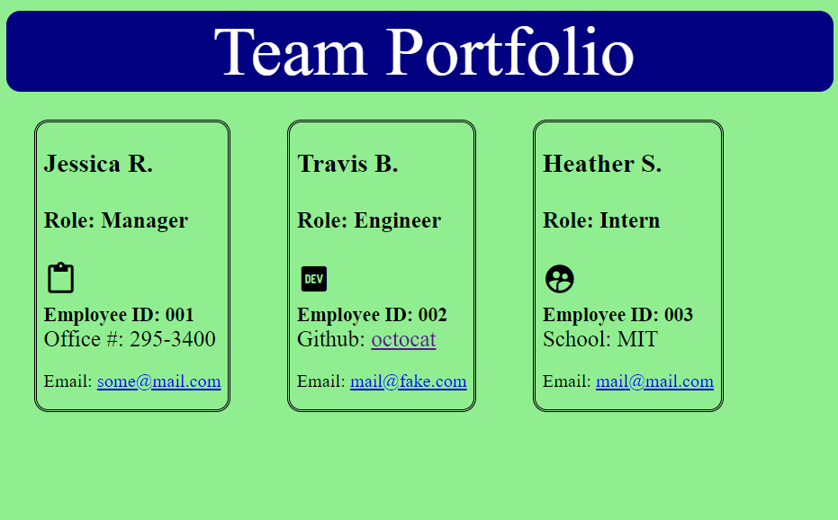

# Team Portfolio Generator

## Description
Simple Command Line Interface (CLI) designed for small businesses which allows the user to enter information about their team and display it as an html page which displays in their browser.

## Table of Contents
* [Installation](#installation)
* [Usage](#usage)
* [Contributors](#contributors)
* [Tests](#tests)
* [Questions](#questions)
* [License](#license) 

## Installation
First install and initialize Node Package Manager (NPM) with "NPM init. Next, install the inquirer module with "node i inquirer." After that, if successfully installed the user can initialize the application with "node index.js."

## Usage
This application is geared toward small business owners who want to have 'at-a-glance' information about their team's members. Information pertinent to the type of employee such as the GitHub repository of their engineers, and email addresses for all the employees will be clickable, and take the user immediately to that resource in either a new browser tab, or open the user's default mail client to quickly email their team members.

To use this application follow the installation instructions above, and initialize the application on the command line with "node index.js." 

An example screenshot is added below to show the output.

## Technologies
JavaScript, Node.js, inquirer.js

## Tests
Tested positive generation of employee classes with Jest.

Contact information (email address & GitHub username) of the developer.
## Questions
kevin.o.foreman2@gmail.com / kevin-foreman (GitHub)

## License

The license used for this project is MIT

Link to demonstration video: www.googledrivevideo.com

